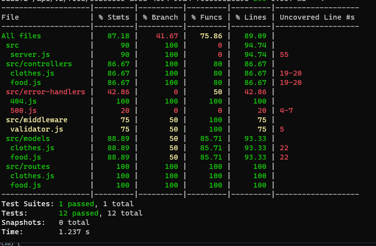
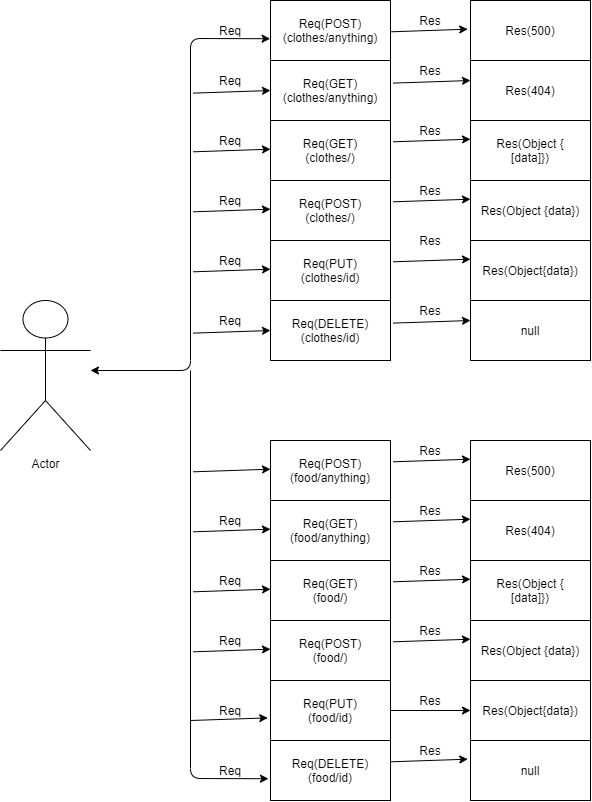

# basic-api-server
Class401-lab3

- **Branch name** : dev
- **Feature requirement:**
    - Two main routes (clothes/ food)
    - Having the ability to get the data from the database for clothes and food
    - Having the ability to add data to the database for clothes and food
    - Having the ability to update an existing data in the database.
    - Having the ability to delete data from the database.
  
- **Tests that assert your features:**
    - [GitHub Action](https://github.com/Samer-Alnajjar/basic-api-server/actions)
    - Coverage

- **UML Diagram**

  

- [Pull Request]([UML_Diagram.png](https://github.com/Samer-Alnajjar/basic-api-server/pull/1))

- [Heroku-deployment](https://samer-basic-api-server.herokuapp.com/)

- How do I install the app or library?
  1. Clone the repo from git hub, by run the following command "git clone -repo-".
  2. Run "npm init -y".
  3. Run "npm i".
  4. Create .env file and PORT inside it.
- How do I test the app or library?
  - Just run "npm test"

- For Applications:
  - How do I run the app?
    - Run "npm start" or "node index.js"
  - How do I set up the app?
    1. Clone the repo from git hub, by run the following command "git clone -repo-".
    2. Run "npm init -y".
    3. Run "npm i".
    4. Create .env file and PORT inside it.
    5. Then run "npm start"